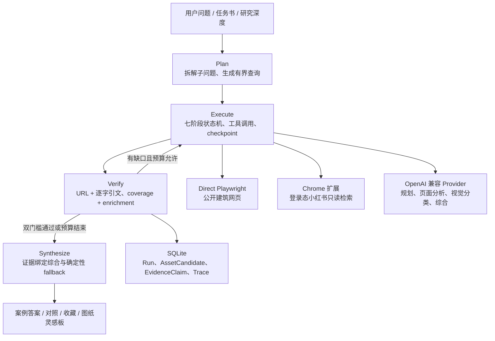

# ArchResearch 本地优先研究工作台

[](https://github.com/jileyu2000/archresearch/actions/workflows/verify.yml)


> 把建筑设计问题变成有出处、能比较、可继续使用的案例答案与图纸灵感板。

ArchResearch 是面向建筑学生和青年设计师的本地优先研究工作台。你可以输入一个具体设计问题，附上任务书 PDF 或案例网页；系统会拆解问题、研究公开网页、核对项目正文与图片关系，再把结果整理成可以直接阅读、收藏、对照和导出的研究材料。

它不是案例搜索结果墙，也不预先建设平台案例库。正式案例中的项目条件和空间机制必须绑定原文引文；小红书只用于寻找配色、线型、版式和分析图语言，不单独证明建筑事实。数据库、收藏、备份和 Provider 配置都保存在用户自己的电脑上。

## 下载与安装

**需要 Windows 11 和 Google Chrome。**

[下载 Windows 安装版 v2.2.2](https://github.com/jileyu2000/archresearch/releases/download/v2.2.2/ArchResearch-Windows-x64-Setup-v2.2.2.exe)

1. 下载并双击 `ArchResearch-Windows-x64-Setup-v2.2.2.exe`。
2. 首次启动填写 API 接口地址和 API Key。地址可以是服务根地址或完整 API 路径；程序会在同一服务地址上自动尝试常见路径，从上游模型列表中选择模型。模型 ID 不可手输；选定模型通过连接测试后才保存，Key 只写入 Windows 凭据管理器。
3. 以后从桌面或开始菜单打开 ArchResearch，它会自动在 Chrome 中显示本地页面。

本地服务、生产界面、SQLite 数据库和运行环境都会自动安装。不需要安装 Python、Node.js、pnpm 或 PowerShell。

> 安装程序暂未签名，Windows 可能显示 SmartScreen 或“未知发布者”。可以在 [v2.2.2 Release](https://github.com/jileyu2000/archresearch/releases/tag/v2.2.2) 核对附件与 SHA-256。

### 需要小红书时

Windows 安装包不包含 Chrome 扩展。需要“图纸灵感”时，另外下载并加载 ArchResearch Chrome 扩展，再从本地页面完成连接。扩展只执行受限的只读研究动作，不上传 Cookie、账号或密码。

[Chrome 扩展安装说明](docs/chrome-extension.md) · [从源码运行](docs/development.md)


## 项目定位

ArchResearch 聚焦建筑设计前期最耗时的一段工作：把一个模糊问题拆成可研究的问题，找到真实项目，核对来源，再把可用结论带回方案。它适用于课程设计、建筑竞赛、毕业设计和青年设计师的早期方案研究。

| 项目维度 | ArchResearch 如何回应 |
| --- | --- |
| 目标用户 | 建筑学生，以及工作 0-3 年、需要快速形成方案依据的青年设计师。 |
| 真实痛点 | 普通搜索把事实、图片和二手转述混在一起；灵感收藏与原设计问题脱节；使用者很难判断“案例为什么适用”。 |
| 使用场景 | 方案前期拆题与案例研究；任务书约束下的定向研究；轴测图、分析图、效果图等表达方向探索。 |
| 实际价值 | 把搜索、网页阅读、证据核对、跨案例比较、收藏与导出串成一条可恢复流程，同时明确证据缺口和图片权利边界。 |

它不是只生成文本的聊天机器人。用户决定研究问题、深度、资料、Provider 与浏览器权限；Agent 负责有界执行；确定性代码负责证据准入、完成判定、权限和导出门禁。

| 任务书约束的案例研究 | 跨案例论证 | 图纸灵感方向 |
| --- | --- | --- |
|  |  |  |

## 可以用它做什么

| 场景 | ArchResearch 的工作 |
| --- | --- |
| 建筑设计研究 | 把总问题拆成可检索的子问题，寻找真实落地项目，并用逐字证据说明案例如何回应当前设计任务。 |
| 图纸灵感 | 围绕轴测图、分析图、效果图等目标扩展不同表达方向，从登录态小红书和当前 Chrome 页面组织视觉参考。 |
| 研究资料管理 | 保存个人收藏、对照案例策略、生成表达规范、按图片权利边界导出，并通过 ZIP 备份或恢复全部本地数据。 |

研究提供“快速找方向 / 形成方案依据 / 做跨案例论证”三种深度。无论选择哪一种，系统都会保留已有结果并如实标记缺口，不把未完成的研究包装成完整答案。

## Agent 架构

ArchResearch 使用 **Evidence-Grounded Plan-and-Execute Agent**。模型只处理适合语言推理的环节，阶段编排、预算、工具权限、证据准入和终态判断由可测试的确定性代码控制。



主要组件：

- `apps/api`：FastAPI、Pydantic v2、SQLAlchemy 2、Alembic 与 SQLite，是唯一研究执行引擎。
- `apps/board`：React、Vite、TypeScript 与 TanStack Query，作为本地生产界面。
- `apps/extension`：Chrome Manifest V3，只执行随包发布的枚举动作。
- `packaging` 与 `scripts/build-windows-installer.ps1`：PyInstaller onedir 与 Inno Setup 的 Windows 发布链。

唯一 orchestrator 位于 [`workflow.py`](apps/api/src/archresearch_api/workflow.py)，保持 `planning -> searching -> inspecting -> analyzing -> verifying -> gap_check -> composing` 的阶段顺序。项目不使用 LangGraph 或多 Agent runtime。

## 模型与密钥

首次配置接受带协议和主机的 HTTP(S) API 地址，不按供应商域名限制；请填写服务实际提供的 OpenAI-compatible base URL，常见形式以 `/v1` 结尾。系统读取上游 `/models`，把可用模型显示为只读选择列表；用户选择后只探测该模型，并依次协商 OpenAI-compatible Responses 与 Chat Completions。验证失败不会覆盖原有配置或凭据。`gpt-5.6-sol` 仅用于读取缺少模型字段的旧配置，不会成为新配置的隐含模型。

API 地址、模型和协议保存在本机配置文件；API Key 只保存在 Windows 凭据管理器，不进入仓库、日志、默认测试或导出包。图片分析要求最终选中的模型支持视觉输入。

## 研究行为

- `precedent_research`：按查询轮换 ArchDaily、Designboom、Dezeen、Divisare、ArchDaily China，并补查项目官网；只有逐字引文支持的项目条件与空间机制进入正式案例。
- `visual_reference_search`：围绕线稿、拼贴、材质渲染、氛围等互不重复的表达方向，从小红书逐帖、逐图检查。每方向最多尝试 4 帖，累计 3 篇 usable；全任务共享 48 个图像槽位与 48 MiB。
- 图纸灵感可用路径全部失败时诚实终止，不恢复 Firecrawl，也不降级为通用网页素材。
- coverage 与 enrichment 同时通过才标记 `completed`；预算耗尽或局部分支失败时保留部分结果与 checkpoint。

## 安全边界

- API 只监听动态选择的回环端口，浏览器页面、健康检查和扩展 endpoint 使用同一端口。
- 扩展只接受枚举 JSON 动作，不接收任意 JavaScript、选择器、凭据、社交动作或通用表单提交。
- `<all_urls>` 只用于用户明确授权后的可见网页读取，可随时撤销；Cookie、LocalStorage、密码框、私信和账号页面禁止读取。
- 截图前后验证目标标签；竞态时丢弃图像。API 与扩展共同拦截私网、保留地址和不安全 URL。
- 分享导出由确定性代码执行版权门禁；未知或受限图片只输出来源卡和链接。

## 验证

```powershell
pnpm test:coverage
pwsh -NoProfile -ExecutionPolicy Bypass -File scripts/verify.ps1
```

第一条命令执行 Board 与 Extension 覆盖率门槛；第二条运行发布合同、Windows 安装器合同、PowerShell 安全与进程生命周期测试、Python 单元/集成测试、Ruff、Mypy、两个 TypeScript 应用的 lint/typecheck/test/build，以及打包后 Chrome 扩展 E2E。默认测试只使用 mock 和本地 fixture，不需要真实 Provider Key。

## 完成度与边界

当前版本是可安装、可持久化、可备份恢复的 V2.2.2 本地系统。Windows 安装器交付自包含 FastAPI 服务与生产 Board；Chrome 扩展保持独立下载。当前支持 Windows 11 + Google Chrome，一次只运行一个研究任务。

安装版的本地回放入口不需要 Key，也不会创建 Workspace 或 ResearchRun：

- `http://127.0.0.1:<当前端口>/?demo=quick`
- `http://127.0.0.1:<当前端口>/?demo=balanced`
- `http://127.0.0.1:<当前端口>/?demo=deep`

实时研究需要用户自己的 OpenAI-compatible Provider。小红书视觉研究还需要用户自己的登录态和独立 Chrome 扩展。

## 交付文档

- [系统架构与数据流](docs/architecture.md)
- [Chrome 扩展安装说明](docs/chrome-extension.md)
- [从源码运行与维护](docs/development.md)
- [失败案例与恢复策略](docs/failure-cases.md)
- [两条完整演示流程](docs/demo-flows.md)
- [25 条版本化研究任务](fixtures/queries/README.md)
- [九类图纸分类评测集](fixtures/evaluation/README.md)

## 设计与计划

- [V2.1 设计规格](docs/superpowers/specs/2026-07-11-arch-research-v2-design.md)
- [实施计划](task_plan.md)
- [关键发现](findings.md)
- [阶段进展](progress.md)
