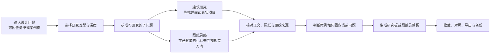

# ArchResearch 建筑研究工作台

> 从一个还没想清楚的设计问题出发，找到真实案例、核对原始来源，整理成能继续用于方案的研究板。

ArchResearch 面向建筑学生和青年设计师，处理方案前期最费时间的一段工作：拆问题、找案例、读项目、核对证据，再把结论带回设计。你可以研究空间组织和设计策略，也可以从小红书寻找剖面图、轴测图、爆炸图、效果图等视觉方向。

它会保存研究过程、来源、图片、收藏和未完成结果。所有数据留在自己的电脑上，之后可以继续研究、比较案例或备份迁移。

### v2.3.0 更新

- 建筑设计研究与图纸灵感使用各自独立的检索和执行路径，互不降级或混用来源。
- 建筑研究会从子问题的空间关系、证据角度和恢复阶段生成互补检索词，提高案例召回与项目多样性，同时继续保留正文证据门槛。
- 修复图纸灵感中的浏览器标签时序、窗口状态和笔记路径识别问题，减少空结果、错误素材和流程卡住。
- 每个子问题的案例数量只作为补查提示，不是完成研究的硬配额；已有结果和证据缺口都会如实保留。

## 下载与安装

ArchResearch 当前支持 **Windows 11 + Google Chrome**。

[下载 Windows 安装版 v2.3.0](https://github.com/jileyu2000/archresearch/releases/download/v2.3.0/ArchResearch-Windows-x64-Setup-v2.3.0.exe)

1. 下载并运行 `ArchResearch-Windows-x64-Setup-v2.3.0.exe`。
2. 首次启动时填写自己的 OpenAI-compatible API 地址和 API Key，再从接口返回的模型列表中选择模型。
3. 以后从桌面或开始菜单打开 ArchResearch，研究工作台会自动显示在 Chrome 中。

安装器已经包含本地服务、工作界面、数据库和运行环境，不需要另外安装 Python 或 Node.js。安装程序暂未签名，Windows 可能显示 SmartScreen 或“未知发布者”，可以在 [v2.3.0 Release](https://github.com/jileyu2000/archresearch/releases/tag/v2.3.0) 核对附件和 SHA-256。

### 使用图纸灵感

“图纸灵感”需要单独安装 Chrome 扩展。Windows 安装器不会捆绑扩展。

[下载 Chrome 扩展 v2.3.0](https://github.com/jileyu2000/archresearch/releases/download/v2.3.0/archresearch-chrome-extension-only-v2.3.0.zip) · [查看安装说明](docs/chrome-extension.md)

扩展装好后，从 ArchResearch 进入“图纸灵感”即可。若尚未登录小红书，工作台会打开登录页并等待；登录完成后会自动继续检测。

## 可以用它做什么

| 功能 | 适合的问题 | 得到的结果 |
| --- | --- | --- |
| 建筑设计研究 | 空间怎样组织、流线如何分开、剖面如何建立层次、旧建筑怎样植入新功能 | 按子问题整理的案例结论、原文证据、图纸和可转译做法 |
| 图纸灵感 | 想找轴测图、剖面图、爆炸图、效果图的构图、配色、线型或版式方向 | 按视觉方向分组的小红书图纸参考与来源链接 |
| 研究资料管理 | 想保存灵感、比较案例、整理表达规范或迁移研究资料 | 个人收藏、案例对照、表达规范、导出与 ZIP 备份 |

| 任务书约束的案例研究 | 跨案例论证 | 图纸灵感方向 |
| --- | --- | --- |
|  |  |  |

## ArchResearch 怎样完成一次研究

研究从用户的问题开始。ArchResearch 会结合任务书和研究深度拆出若干子问题，为每个子问题寻找材料。建筑研究读取真实项目正文和图纸；图纸灵感则按图纸类型与视觉方向整理小红书参考。

找到材料后，系统会区分来源事实、图纸观察和设计推断。正式结论保留来源链接和原文证据，方便回到原页面复核。资料不足时，系统会继续补查；达到时间或数量上限时，也会保存已有内容并明确标出缺口。

## 两种研究方式

### 建筑设计研究

适合课程设计、竞赛、毕业设计和实际项目前期。你不必先想好搜索词，只需要说明卡住的问题，例如：

- 旧建筑主体结构不动，新的公共功能怎样植入？
- 人车在入口冲突，落客、步行和后勤流线怎样重组？
- 层高已经确定，剖面还能怎样建立连续的空间层次？

研究可以选择“快速找方向”“形成方案依据”或“做跨案例论证”。结果会按子问题组织，每个案例都说明项目条件、采用的空间机制、可借鉴的步骤和仍需核对的限制。

### 图纸灵感

只需要说清图纸类型和视觉方向，例如“想比较剖面图的精细线稿、低饱和色块和拼贴叙事”。ArchResearch 会把不同方向分开搜索和整理，不要求填写住宅、学校、场馆等建筑类型。

图纸灵感只使用用户自己的小红书登录态。首次未登录时，工作台会直接打开小红书；登录后自动检测，已登录过的 Chrome 则可以直接进入研究。

## 一次研究会留下什么

- 按子问题整理的结论，不是一串搜索结果。
- 真实项目和来源链接，可回到原页面继续阅读。
- 支撑结论的原文证据，以及与证据对应的图纸或图片。
- 从案例做法转回当前设计问题的具体步骤。
- 对证据缺口、适用边界和图片权利状态的说明。
- 可继续编辑的收藏、案例对照和图纸表达规范。

研究在后台分阶段进行。关闭页面或某个来源暂时失败时，已经取得的结果仍会保留；回到工作台后可以继续查看进度。

## 使用步骤

1. 新建一个项目，写下当前最需要解决的设计问题。
2. 选择“建筑设计研究”或“图纸灵感”，再决定研究深度。
3. 需要时附上任务书 PDF、草图、图纸或指定案例页。
4. 启动研究，在“最近研究”中查看进度；一次只运行一个研究任务。
5. 阅读研究板，把有用案例加入收藏、做对照或导出，并定期备份本地数据。

## 本地数据与安全

- Workspace、Research Run、图片、收藏和备份都保存在本机。
- API 地址、模型和协议保存在本地配置中；API Key 只写入 Windows 凭据管理器。
- Chrome 扩展只执行预先定义的只读研究动作，不接收任意脚本或通用表单操作。
- 登录检测不会把 Cookie、账号或密码交给 ArchResearch，也不会把这些内容写入数据库、日志或备份。
- 导出时会根据图片权利状态决定是否包含图片；来源不明确的图片只保留来源卡和链接。

实时研究需要用户自己的 OpenAI-compatible Provider。涉及图片分析时，所选模型还需要支持视觉输入。

## 文档

- [Chrome 扩展安装说明](docs/chrome-extension.md)
- [两条完整演示流程](docs/demo-flows.md)
- [系统架构与数据流](docs/architecture.md)
- [失败情况与恢复方式](docs/failure-cases.md)
- [从源码运行与维护](docs/development.md)
