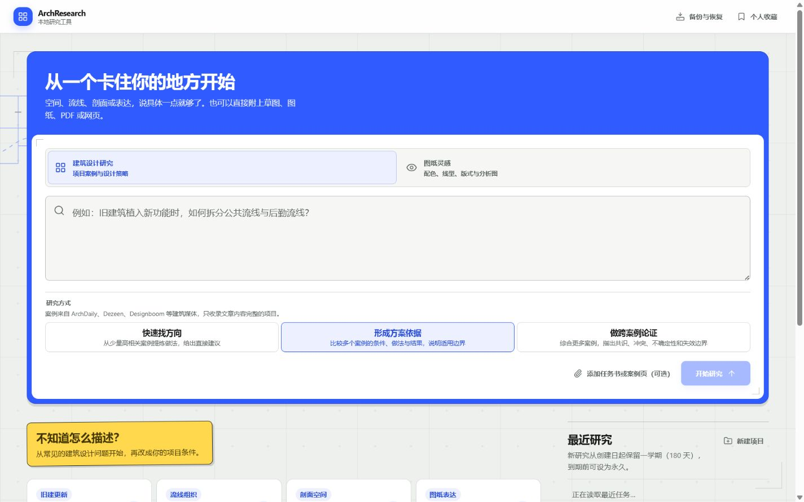
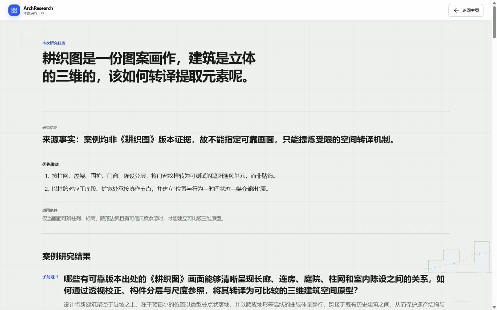
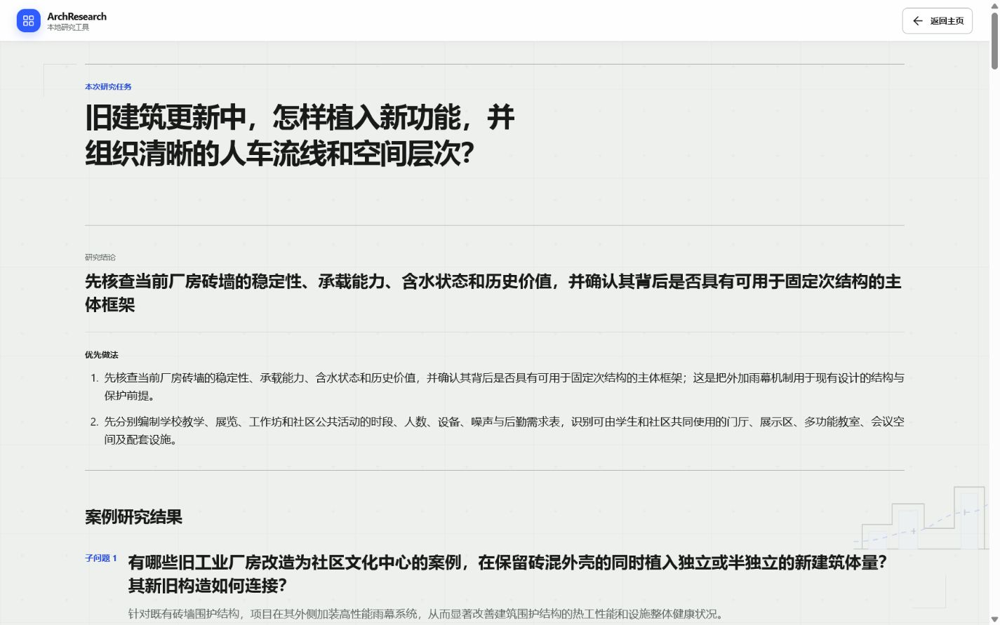
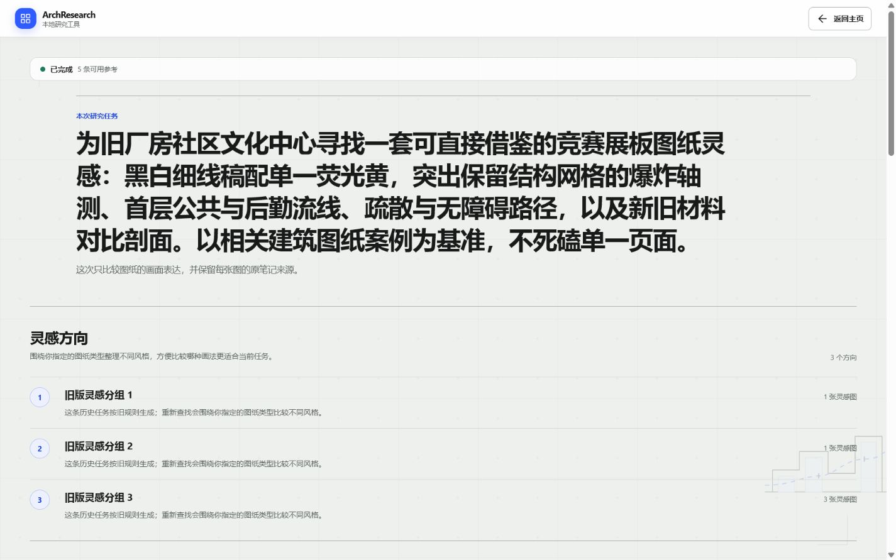
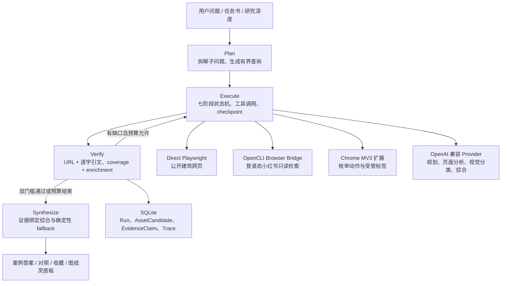

# ArchResearch

[](https://github.com/jileyu2000/archresearch/actions/workflows/verify.yml)


> 把建筑设计问题变成有出处、能比较、可继续使用的案例答案与图纸灵感板。

ArchResearch 是为建筑学生和青年设计师制作的本地优先研究工作台。你可以输入一个具体设计问题，附上任务书 PDF 或案例网页；系统会拆解问题、研究公开网页、核对项目正文与图片关系，再把结果整理成可以直接阅读、收藏、对照和导出的研究材料。

它不是案例搜索结果墙，也不预先建设平台案例库。正式案例中的项目条件和空间机制必须绑定原文引文；小红书只用于寻找配色、线型、版式和分析图语言，不单独证明建筑事实。数据库、收藏和备份都保存在用户自己的电脑上。



## 参赛定位

本仓库是 ArchResearch 参加[第一届“海之子”杯 AI 智能体挑战计划](https://aicampus.3311csci.com)的公开代码与展示页，投稿方向为“建筑真实场景 + 工作提效”。评审可直接跳到[评审访问与演示](#评审访问与演示)。

**作品简介（100 字内）**：ArchResearch 是面向建筑学生与青年设计师的本地优先研究智能体，把设计问题拆成可核验子问题，实时研究公开网页，并以逐字证据生成案例答案、对照与图纸灵感板。

| 技术说明模板要求 | ArchResearch 的回答 |
| --- | --- |
| 目标用户 | 正在做课程设计、竞赛或毕业设计的建筑学生，以及工作 0–3 年、需要快速形成方案依据的青年设计师。 |
| 真实痛点 | 普通搜索把事实、图片和二手转述混在一起；灵感收藏与原设计问题脱节；使用者很难在有限时间内判断“案例为什么适用”。 |
| 使用场景 | 方案前期拆题与案例研究；任务书约束下的定向研究；轴测图、分析图、效果图等表达方向探索。 |
| 实际价值 | 把搜索、网页阅读、证据核对、跨案例比较、收藏与导出串成一条可恢复流程，同时明确证据缺口和图片权利边界。 |

它不是一个只会生成文本的聊天机器人。用户决定研究问题、深度、资料与浏览器权限；Agent 负责有界执行；确定性代码负责证据准入、完成判定、权限和导出门禁。

| 任务书约束的案例研究 | 跨案例论证 | 图纸灵感方向 |
| --- | --- | --- |
|  |  |  |

## 可以用它做什么

| 场景 | ArchResearch 的工作 |
| --- | --- |
| 建筑设计研究 | 把总问题拆成可检索的子问题，寻找真实落地项目，并用逐字证据说明案例如何回应当前设计任务。 |
| 图纸灵感 | 围绕轴测图、分析图、效果图等目标扩展不同表达方向，从登录态小红书与当前 Chrome 页面组织视觉参考。 |
| 研究资料管理 | 保存个人收藏、对照案例策略、生成表达规范、按图片权利边界导出，并通过 ZIP 备份或恢复全部本地数据。 |

研究提供“快速找方向 / 形成方案依据 / 做跨案例论证”三种深度。无论选择哪一种，系统都会保留已有结果并如实标记缺口，不把未完成的研究包装成完整答案。

## Evidence-Grounded Plan-and-Execute Agent

ArchResearch 采用 **Evidence-Grounded Plan-and-Execute Agent**。这是项目自身的运行架构，不是用框架名称包装一次模型调用：模型只处理适合语言推理的环节，阶段编排、预算、工具权限、证据准入和终态判断均由可测试的确定性代码控制。



代码边界与上述职责一一对应：

- [`agent/planning.py`](apps/api/src/archresearch_api/agent/planning.py)：计划生成、确定性 fallback、查询预算和可信站点轮换。
- [`agent/execution.py`](apps/api/src/archresearch_api/agent/execution.py)：取消、checkpoint、恢复去重、页面预算和运行计数。
- [`agent/verification.py`](apps/api/src/archresearch_api/agent/verification.py)：逐题 coverage、证据丰富度与完成门槛。
- [`agent/synthesis.py`](apps/api/src/archresearch_api/agent/synthesis.py)：只消费已绑定证据的综合内核与可恢复 fallback。
- [`workflow.py`](apps/api/src/archresearch_api/workflow.py)：唯一 orchestrator，保持 `planning → searching → inspecting → analyzing → verifying → gap_check → composing` 的阶段顺序。

项目不依赖 LangChain、LangGraph、OpenAI Agents SDK 或多智能体运行时。Provider 调用仍封装在小型具体客户端之后，默认测试全部使用确定性 mock。

运行组件：

- `apps/board`：React、Vite、TypeScript、TanStack Query。
- `apps/api`：FastAPI、Pydantic v2、SQLAlchemy 2、Alembic、SQLite。
- `apps/extension`：Chrome Manifest V3，只执行随包发布的固定动作。
- `.archresearch`：本地数据库、导出、日志和开发进程状态。

## 人机协同与纠偏

| 环节 | 人负责 | AI 负责 | 确定性系统负责 |
| --- | --- | --- | --- |
| 研究规划 | 提出问题、附任务书、选择研究深度 | 拆解子问题、生成检索方向 | 校验 typed plan、限制问题数/轮数/查询数、失败时使用确定性计划 |
| 研究执行 | 授权浏览器、决定是否继续补齐 | 分析页面正文和图片、估计相关性 | 只调用白名单工具，保存 checkpoint，取消/恢复不丢已有结果 |
| 证据与综合 | 判断案例是否适合自己的设计条件 | 归纳机制、比较案例、生成转译建议 | 每条正式事实绑定 URL 与逐字引文；relevance 只排序；coverage 与 enrichment 同时通过才 completed |
| 收藏与交付 | 主动收藏、删除、对照和导出 | 组织阅读结构与表达方向 | 收藏纯累加；未知权利图片降级为来源卡；不替用户执行社交或发布动作 |

交互迭代不是无限自主循环。Agent 在 `gap_check` 发现逐题缺口后，只有在剩余查询、页面和时间预算允许时才定向补查；模型或网页失败时保留部分结果并记录原因。来源偏差通过建筑媒体轮换、项目官网补证、逐字引文门槛和“小红书只做视觉灵感”来约束，而不是让模型自行宣称可信。

## 快速开始

环境要求：Windows 11、Chrome、Python 3.12、Node.js 24、pnpm 11。

```powershell
Copy-Item .env.example .env
pwsh -NoProfile -ExecutionPolicy Bypass -File scripts/setup.ps1
pwsh -NoProfile -ExecutionPolicy Bypass -File scripts/start.ps1
```

启动脚本会输出实际地址；默认是：

- 参考板：`http://127.0.0.1:5173`
- API：`http://127.0.0.1:8000`
- 扩展目录：`apps/extension/dist`

要让 Windows 重启并登录后自动恢复本地页面，执行一次：

```powershell
pwsh -NoProfile -ExecutionPolicy Bypass -File scripts/configure-autostart.ps1
```

它只为当前用户创建隐藏启动入口，仍复用上面的健康检查与进程状态。要移除该入口，执行同一脚本并增加 `-Disable`。

停止本地服务：

```powershell
pwsh -NoProfile -ExecutionPolicy Bypass -File scripts/stop.ps1
```

### 更新已有安装

在你已经通过下载新版本或自己的 Git 操作替换源码后，运行：

```powershell
pwsh -NoProfile -ExecutionPolicy Bypass -File scripts/update.ps1
```

更新脚本不会执行 `git pull`、reset、checkout 或 clean。它只依次停止当前工作区服务、重新安装依赖并构建扩展、运行完整离线门禁，再启动验证通过的版本；若安装或验证失败，脚本立即停止，不会启动未通过门禁的版本。本地研究数据继续保存在 `.archresearch`，更新前也可先从“备份数据”页面下载独立 ZIP。

### 安装扩展与配对

1. 打开 `chrome://extensions`，启用开发者模式。
2. 选择“加载已解压的扩展程序”，使用 `apps/extension/dist`。
3. 在参考板点击“一键连接浏览器”；手动地址和配对码只作为故障恢复入口。
4. 首次使用时由 Chrome 确认网页读取权限；授权会保留，直到用户在扩展中主动撤销或卸载扩展。

### 启用小红书登录态研究

1. 从 [Chrome Web Store](https://chromewebstore.google.com/detail/opencli/ildkmabpimmkaediidaifkhjpohdnifk) 安装一次 **OpenCLI Browser Bridge**。
2. 在同一个 Chrome 中登录小红书。OpenCLI daemon 会在研究时按需启动，不需要每次配对。
3. 可用 `pnpm opencli -- doctor` 检查 Bridge；项目已锁定 `@jackwener/opencli@1.8.6`，无需全局安装 CLI。

ArchResearch 扩展与 OpenCLI Bridge 职责不同：前者负责通用登录页面裁图和故障回退，后者是小红书的主搜索/轮播多图路径。两者都不会替用户点赞、收藏、评论或发布。

Chrome 的 `captureVisibleTab` 只接受用户手势产生的 `activeTab` 或 `<all_urls>` host permission。连续研究无法要求用户逐页点击，因此扩展从自身弹窗的直接用户手势请求可选的 `<all_urls>`，并保留到用户主动撤销或卸载扩展；实际导航、脚本注入和最终 URL 复核仍严格限制为公网 HTTP/HTTPS，不接受 `file:`、扩展页、回环或私网地址。研究终态仍会关闭扩展打开的标签页。

动态页面读取只作用于扩展创建的受管标签：扩展先创建空白标签并写入 `chrome.storage.session`，再监听该 tab 的 `loading` 事件、立即注入随包发布的固定读取器，确认监听器就绪后才向本地 API 返回 tab id。后续页面命令不重复注入；关闭、终态、断线、撤权或工作线程重启都会清理受管标签和监听器。系统不使用按域名全局注册的内容脚本，因此不会把研究读取器注入用户其他同域标签。

本地首版一次只执行一个研究。新建或重试时若已有研究在运行，界面会要求先等待完成或取消；这避免两个任务共用同一个 Chrome 连接时互相关闭标签。研究终态先送达扩展并完成标签清理，运行槽位才释放给下一次研究。

## 模型与密钥

默认 `ARCHRESEARCH_PROVIDER_MODE=mock`，不需要任何 Key，适合开发、测试和作品集演示。

梭子蟹中转站使用下面的安全配置命令。命令会隐藏输入，先执行一次小型、可能产生费用的 `gpt-5.6-sol + medium` 结构化输出测试；只有测试通过后，才把 Key 保存到 Windows 凭据管理器，并将不含密钥的模型配置写入本地工作区。已经启动 ArchResearch 时，配置完成后需要重启服务。

```powershell
pwsh -NoProfile -ExecutionPolicy Bypass -File scripts/configure-provider.ps1
```

公开建筑网站由 Direct Playwright 在不落盘的隔离上下文中提取正文、项目链接、图片 URL 和图注；图片、媒体和字体请求默认拦截以降低流量。小红书默认由 OpenCLI Browser Bridge 使用用户已登录的 Chrome 执行只读搜索和多图下载。每个灵感方向按 rank 最多尝试四篇笔记，累计三篇产生可用图的帖子后停止；每篇等距选取最多四图并合并为一次视觉分类。图纸灵感共享 48 个逐图检查槽位 / 48 MiB 预览预算。OpenCLI 不可用或返回空结果时回退 ArchResearch 扩展；两条小红书路径都不可用时诚实终止，不降级为通用网页素材。

也可以通过本地 `.env` 启用其他 OpenAI 兼容配置。研究规划、已抓页面分析和视觉分类默认统一使用 `gpt-5.6-sol`，推理强度统一为 `medium`；模型名仍可分别覆盖。不要把 `.env` 或任何 Key 提交到 Git。

```dotenv
ARCHRESEARCH_PROVIDER_MODE=openai
OPENAI_API_KEY=
OPENAI_RESEARCH_MODEL=gpt-5.6-sol
OPENAI_VISION_MODEL=gpt-5.6-sol
```

## 研究行为

支持两类研究目标：

- `precedent_research`：按查询轮换 ArchDaily、Designboom、Dezeen、Divisare、ArchDaily China，并继续核对事务所官网等落地项目正文；只有逐字引文支持的项目条件与空间机制进入结果。一个项目可聚合主文章和最多两个定向补充文字来源，转译策略明确属于 ArchResearch 分析。图片只作为可选预览和原站入口。
- `visual_reference_search`：接受“我想出一张轴测图，帮我找风格”“效果图怎么出”这类宽泛提问；用户点名图纸类型时固定该类型，只规划线稿、拼贴、材质渲染、氛围等互不重复的表达方向，再从小红书分类与重排。

建筑设计研究的“快速找方向 / 形成方案依据 / 做跨案例论证”（内部值 `quick / balanced / deep`）都以覆盖各自拆解出的全部子问题，并同时达到正文分析丰富度作为 `completed` 标准。三种深度共用 30 分钟的单次执行安全上限；差异只在子问题数量、每题研究轮数、目标案例数量和分析要求。图纸灵感不显示三档深度，使用固定视觉配置并以各灵感方向获得可用图片为覆盖标准；若 48 个逐图检查槽位耗尽时仍有方向未达到三篇 usable 帖子，结果诚实保留为 `partial`，停止原因为 `visual_budget_exhausted`。局部分支不完整时保留已有结果并明确缺口，不会把不完整结果伪装成全覆盖，也不会丢弃已经有用的答案。

作品集演示使用固定回放数据：`?demo=quick`、`?demo=balanced`、`?demo=deep`。三页分别展示“快速找方向 / 形成方案依据 / 做跨案例论证”的 3、4、6 个完整子问题，并在首屏标明各自的研究深度合同。

设计策略研究会先把总问题拆成 3–6 个可检索子问题，再分别召回并读取项目正文。结果按“子问题 → 项目档案 → 正文证据”组织；事实完整性在声明级校验，每条事实分别保留 URL 和逐字引文。同一项目的一篇文章只有背景或局部机制时，系统最多执行一次项目名与缺失主题的定向补查、读取两个可信文字页，再把可核验证据合并到项目档案；不同项目绝不合并。转译步骤和适用边界是基于这些证据的研究分析。同源图片可以作为预览，但不参与证明机制，也不要求精准对应当前问题；文字覆盖未完成时不执行图片批次。

来源不是一条固定高低链：项目官网和可信建筑媒体主要回答“方案怎么成立”，小红书主要回答“图怎么出”。视觉平台图片按“灵感方向 → 图纸类型 → 可见观察”进入独立灵感板，不计入方案项目数量，也不能单独确认项目事实、图纸归属或使用权。工作流会随研究目标切换网页检查优先级。

每张预览图片分别记录来源等级、项目身份、图片归属、首发来源、版权状态和结果等级。只有正文逐字证据支持的事实才生成正式证据声明，并绑定 URL 或 PDF 定位；正文事实、图片可见观察、设计推断和适用边界分开显示。`visual_reference_search` 或明确找图任务仍按图片与问题的视觉相关性筛选。

## 安全边界

- API 仅监听回环地址；扩展令牌保存在本地，API 落盘只保存摘要。
- 扩展只接受枚举 JSON 动作，不接收任意 JavaScript、选择器或远程代码。
- `<all_urls>` 只用于 Chrome 可见页裁图能力，必须由用户从扩展界面明确授予，并可随时撤销；它不会扩大动作 DSL 的公网 HTTP/HTTPS 范围。
- 禁止读取 Cookie、LocalStorage、密码框、私信和账号页面。
- 通用网页 `safe_click` 保留协议但默认不执行不可信页面点击。
- 截图前后验证目标标签；竞态时丢弃图像。
- API 与扩展共同拦截私网、保留地址和不安全 URL。
- OpenCLI 适配器只允许小红书 `search`、`note`、`download` 三种只读命令；当前研究闭环只调用 `search` 与 `download`。子进程不经 shell，Trace 不保存查询、签名参数、stderr 或完整登录页。
- 分享版导出由确定性代码执行版权门禁；未知或受限图片只输出来源卡和链接。

## 验证

```powershell
pnpm test:coverage
pwsh -NoProfile -ExecutionPolicy Bypass -File scripts/verify.ps1
```

第一条命令执行 Board 与 Extension 覆盖率门槛；第二条运行发布、PowerShell 安全与进程生命周期测试、评测夹具验证、Python 单元/集成测试、Ruff、Mypy、两个 TypeScript 应用的 lint/类型检查/测试/生产构建，以及打包后 Chrome 扩展 E2E。所有默认测试均使用 Mock/本地 fixture，不调用真实模型或公开搜索网页。

只验证版本化评测集：

```powershell
pwsh -NoProfile -ExecutionPolicy Bypass -File scripts/validate-evaluation-fixtures.ps1
```

## 完成度与已知边界

当前参赛版本是可安装、可持久化、可备份恢复的 V2.1 系统，不是界面原型。Agent 四模块边界、七阶段 checkpoint、任务书流程、个人收藏、跨案例对照、权利门禁导出和 Chrome 扩展均已有行为测试。最新本地发布门禁为 **360 API / 177 Board / 165 Extension / 8 packaged E2E**，并包含 Ruff、strict Mypy、TypeScript lint/typecheck、production build、进程、安全和评测夹具检查；默认测试不调用真实模型或公开网页。完整证据见[发布验证记录](docs/release-evidence-2026-07-28.md)。

产品刻意保持本地优先边界：当前支持 Windows 11 + Chrome，一次只运行一个研究任务，不提供公网 SaaS；实时网页研究需要使用者主动配置自己的 OpenAI 兼容 Provider，并授予所需浏览器权限。小红书视觉研究还需要使用者自己的登录态和 OpenCLI Browser Bridge。未知或受限权利图片只能作为来源卡与链接交付，不能由 Agent 自动升级权利状态。

## 评审访问与演示

本仓库同时作为代码包和公开展示页。按[快速开始](#快速开始)完成安装并启动后，参考板默认位于 `http://127.0.0.1:5173`。安装完成后的最短评审路径是直接打开三个纯本地回放入口：

- 快速找方向：`http://127.0.0.1:5173/?demo=quick`
- 形成方案依据：`http://127.0.0.1:5173/?demo=balanced`
- 做跨案例论证：`http://127.0.0.1:5173/?demo=deep`

这些入口不需要 Key，不创建 Workspace 或 ResearchRun，也不请求外部供应商；它们只展示真实产品界面和固定验收数据，不冒充实时网页研究。需要验证持久化闭环时，打开不带 `?demo=` 的正常地址，在默认 `mock` 模式创建工作区和研究即可。

可直接复制的测试问题：

| 研究入口 | 问题 | 建议设置 |
| --- | --- | --- |
| 建筑设计研究 | 寻找面积受限的社区微型图书馆通过家具、楼梯和夹层复合使用的剖面与室内照片。 | 快速找方向 |
| 建筑设计研究 | 寻找中小型博物馆中观众、工作人员和藏品运输三套流线分离的平面和流线分析图。 | 做跨案例论证 |
| 图纸灵感 | 我想出一张低饱和分层轴测图，帮我找保留结构与新增体量的颜色区分方式。 | 实时测试需登录态小红书与 OpenCLI Bridge |

任务书路径可在建筑设计研究中附加自己的 PDF，系统会先提取项目边界，再把确认后的子问题写入同一研究 Run。仓库另含[25 条版本化研究任务](fixtures/queries/README.md)；两条完整演示流程、预期证据边界和失败恢复路径见[演示流程](docs/demo-flows.md)。

## 交付文档

- [系统架构与数据流](docs/architecture.md)
- [失败案例与恢复策略](docs/failure-cases.md)
- [两条完整演示流程](docs/demo-flows.md)
- [历史 gpt-5.5 实时研究 Smoke 记录](docs/evaluation/live-smoke-2026-07-11.md)
- [25 条版本化研究任务](fixtures/queries/README.md)
- [九类图纸分类评测集](fixtures/evaluation/README.md)

## 设计与计划

- [V2.1 设计规格](docs/superpowers/specs/2026-07-11-arch-research-v2-design.md)
- [实施计划](task_plan.md)
- [关键发现](findings.md)
- [阶段进展](progress.md)
