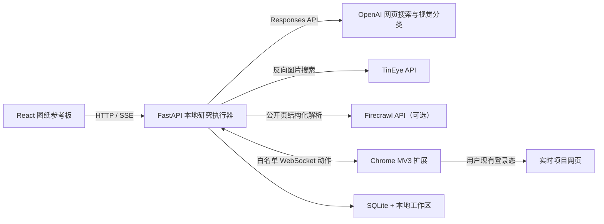

# ArchResearch V2.1

面向建筑学生和青年设计师的本地优先实时研究 Agent。用户输入具体设计问题，并可附加图片、PDF 或 URL；系统进行有预算的多轮网页研究，定位平面、剖面、分析图和效果图，核验图片与项目来源关系，最后编排成可筛选、比较和导出的图纸参考板。

本项目不建设平台案例库，不维护全局图片索引，也不跨工作区复用第三方图像语料。

## 架构



- `apps/board`：React、Vite、TypeScript、TanStack Query。
- `apps/api`：FastAPI、Pydantic v2、SQLAlchemy 2、Alembic、SQLite。
- `apps/extension`：Chrome Manifest V3，只执行随包发布的固定动作。
- `.archresearch`：本地数据库、导出、日志和开发进程状态。

## 快速开始

环境要求：Windows 11、Chrome、Python 3.12、Node.js 24、pnpm 11。

```powershell
Copy-Item .env.example .env
pwsh -NoProfile -ExecutionPolicy Bypass -File scripts/setup.ps1
pwsh -NoProfile -ExecutionPolicy Bypass -File scripts/start.ps1
```

启动脚本会输出实际地址；默认是：

- 参考板：`http://127.0.0.1:5173`
- API：`http://127.0.0.1:8000`
- 扩展目录：`apps/extension/dist`

停止本地服务：

```powershell
pwsh -NoProfile -ExecutionPolicy Bypass -File scripts/stop.ps1
```

### 安装扩展与配对

1. 打开 `chrome://extensions`，启用开发者模式。
2. 选择“加载已解压的扩展程序”，使用 `apps/extension/dist`。
3. 在参考板点击“一键连接浏览器”；手动地址和配对码只作为故障恢复入口。
4. 开始研究时由 Chrome 确认临时网页读取权限；终止、失败或断线后自动撤销。

Chrome 的 `captureVisibleTab` 只接受用户手势产生的 `activeTab` 或 `<all_urls>` host permission。连续研究无法要求用户逐页点击，因此扩展只在任务期间请求可选的 `<all_urls>`，并在终态立即撤销；实际导航、脚本注入和最终 URL 复核仍严格限制为公网 HTTP/HTTPS，不接受 `file:`、扩展页、回环或私网地址。

## 模型与密钥

默认 `ARCHRESEARCH_PROVIDER_MODE=mock`，不需要任何 Key，适合开发、测试和作品集演示。

梭子蟹中转站使用下面的安全配置命令。命令会隐藏输入，先执行一次可能产生费用的 Responses + `web_search` 能力测试；只有测试通过后，才把 Key 保存到 Windows 凭据管理器，并将不含密钥的 `gpt-5.5` 配置写入本地工作区。已经启动 ArchResearch 时，配置完成后需要重启服务。

```powershell
pwsh -NoProfile -ExecutionPolicy Bypass -File scripts/configure-provider.ps1
```

Firecrawl 是可选的公开页面增强器：配置后，每次研究都会在页面预算内解析候选公网来源，把最新 Markdown 加入图纸视觉分类上下文，并补充网页中明确标注类型的图片线索。Chrome 扩展同时负责登录态、动态交互和精确裁图；Firecrawl 线索在完成视觉分类和来源绑定前始终标为未核验，不会自动升级事实、归属或版权。Key 通过隐藏输入保存到 Windows 凭据管理器：

```powershell
pwsh -NoProfile -ExecutionPolicy Bypass -File scripts/configure-firecrawl.ps1
```

也可以通过本地 `.env` 启用其他 OpenAI 兼容配置。研究规划、网页研究和视觉分类默认统一使用 `gpt-5.5`，模型名仍可分别覆盖。不要把 `.env` 或任何 Key 提交到 Git。

```dotenv
ARCHRESEARCH_PROVIDER_MODE=openai
OPENAI_API_KEY=
OPENAI_RESEARCH_MODEL=gpt-5.5
OPENAI_VISION_MODEL=gpt-5.5
TINEYE_API_KEY=
FIRECRAWL_API_KEY=
FIRECRAWL_API_URL=https://api.firecrawl.dev/v2
```

## 研究行为

支持三类研究目标：

- `precedent_research`：设计策略与具体图纸研究。
- `source_lookup`：截图或上传图片的来源反查。
- `visual_reference_search`：按可见表达特征搜索并重排。

Quick、Balanced、Deep 使用固定轮数、查询数、页面数和时间预算。满足覆盖条件时提前结束；连续两批没有新增有效资产、浏览器不可用、网站阻塞或供应商失败时，已有结果会保留并以 `partial` 交付。

设计策略研究会先把总问题拆成 3–6 个可检索子问题，再分别召回项目和图纸。结果不是单张图片墙，而是按“子问题 → 项目档案 → 多张互补图纸”组织；每个档案交代项目条件、空间机制、可转译步骤和适用边界。同一图纸支持多个子问题时，各关联保留自己的分析，不把第一个结论复制到其他章节。

每张图纸分别记录来源等级、项目身份、图片归属、首发来源、版权状态和结果等级。只有供应商明确返回的事实才生成正式证据声明，并绑定 URL 或 PDF 定位；项目背景、图像观察、设计推断和适用边界分开显示。

## 安全边界

- API 仅监听回环地址；扩展令牌保存在本地，API 落盘只保存摘要。
- 扩展只接受枚举 JSON 动作，不接收任意 JavaScript、选择器或远程代码。
- `<all_urls>` 只用于 Chrome 可见页裁图能力，必须由用户手势临时授予；它不会扩大动作 DSL 的公网 HTTP/HTTPS 范围。
- 禁止读取 Cookie、LocalStorage、密码框、私信和账号页面。
- 通用网页 `safe_click` 保留协议但默认不执行不可信页面点击。
- 截图前后验证目标标签；竞态时丢弃图像。
- API 与扩展共同拦截私网、保留地址和不安全 URL。
- 分享版导出由确定性代码执行版权门禁；未知或受限图片只输出来源卡和链接。

## 验证

```powershell
pwsh -NoProfile -ExecutionPolicy Bypass -File scripts/verify.ps1
```

该命令运行 PowerShell 安全与进程生命周期测试、评测夹具验证、Python 单元/集成测试、Ruff、Mypy、两个 TypeScript 应用的 lint/类型检查/测试/生产构建，以及打包后 Chrome 扩展 E2E。所有默认测试均使用 Mock，不调用真实 OpenAI、TinEye 或 Firecrawl。

只验证版本化评测集：

```powershell
pwsh -NoProfile -ExecutionPolicy Bypass -File scripts/validate-evaluation-fixtures.ps1
```

## 工作界面与演示

启动后直接打开参考板即可使用真实工作区。无需供应商 Key 的作品集演示位于：

`http://127.0.0.1:5173/?demo=1`

演示数据只用于说明画板交互，与实时研究结果严格分开。三条完整演示流程、预期证据边界和失败恢复路径见[演示流程](docs/demo-flows.md)。

## 交付文档

- [系统架构与数据流](docs/architecture.md)
- [失败案例与恢复策略](docs/failure-cases.md)
- [三条完整演示流程](docs/demo-flows.md)
- [gpt-5.5 实时研究 Smoke 记录](docs/evaluation/live-smoke-2026-07-11.md)
- [30 条版本化研究任务](fixtures/queries/README.md)
- [九类图纸分类评测集](fixtures/evaluation/README.md)

## 设计与计划

- [V2.1 设计规格](docs/superpowers/specs/2026-07-11-arch-research-v2-design.md)
- [实施计划](task_plan.md)
- [关键发现](findings.md)
- [阶段进展](progress.md)
