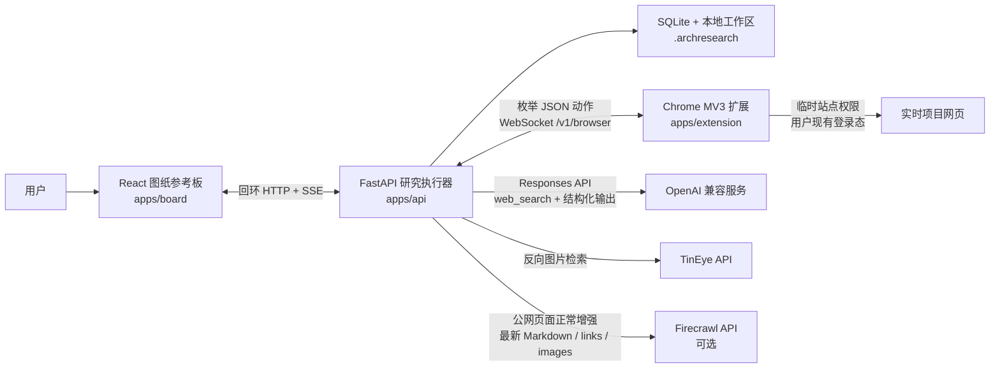
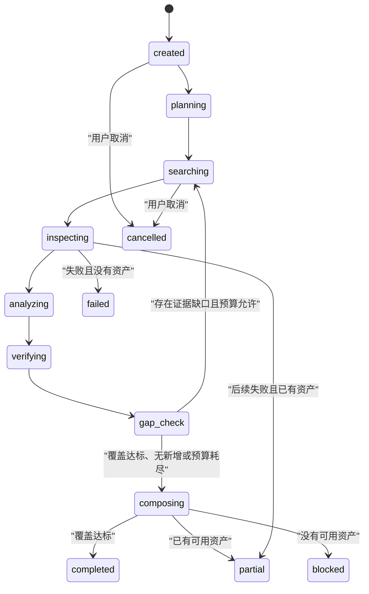
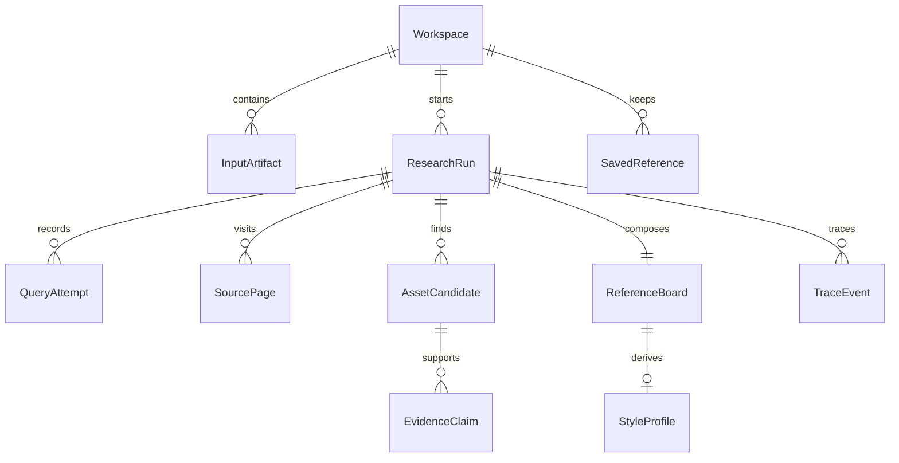

# ArchResearch V2.1 架构

## 产品边界

ArchResearch 是面向单个 Windows/Chrome 用户的本地优先建筑研究工具。它接收具体设计问题和可选的图片、PDF、URL，在限定轮数、查询数、页面数与时间内研究当前网页，识别建筑图纸并把来源证据编排成参考板。

系统不建设平台案例库，不维护跨项目图片索引，不把收藏或拒绝记录变成公共语料，也不引入 PostgreSQL、Redis、S3、Qdrant、Celery、Docker、LangGraph 或多 Agent 运行时。

## 运行组件

| 组件 | 职责 | 不负责 |
|---|---|---|
| 参考板 | 工作区输入、运行状态、筛选、证据详情、收藏/拒绝、2–6 项比较、StyleProfile 与导出 | 自行抓网页、决定来源可信度 |
| 本地 API | 状态机、预算、供应商调用、来源与资产持久化、排序、检查点、版权门禁、TTL 清理 | 使用浏览器 Cookie、运行远程脚本 |
| Chrome 扩展 | 在用户动作授权后打开页面、读取受限语义快照与元数据、枚举媒体、滚动、裁取候选区域 | 读取 Cookie/LocalStorage/密码/私信，发布、点赞、购买或提交普通表单 |
| Firecrawl（可选） | 用子问题级短查询实时发现并解析公开页面；Markdown 增强视觉分类，明确类型且已去重的图片增加低置信召回 | 登录态页面、页面交互、来源/版权升级、批量站点爬取 |
| SQLite/工作区 | 保存业务对象、检查点、临时裁图和导出 | 跨 Workspace 或跨用户召回 |

API 只监听 `127.0.0.1`。扩展首次用一次性配对码连接，随后把轮换后的令牌放在 `chrome.storage.local`；API 落盘保存令牌摘要。

## 研究状态机

每个阶段向 SQLite 提交检查点并写入脱敏 `TraceEvent`。应用启动时清理过期临时数据，并恢复未进入终态的运行。`partial`、`blocked`、`cancelled` 和 `failed` 可重试；重试增加 `attempt`，保留已有资产与证据。

默认预算：

| 模式 | 轮次 | 查询 | 页面 | 时间 |
|---|---:|---:|---:|---:|
| Quick | 2 | 4 | 12 | 4 分钟 |
| Balanced | 3 | 8 | 30 | 12 分钟 |
| Deep | 5 | 16 | 60 | 30 分钟 |

当前统一提前停止条件为至少 6 张可用资产、3 个项目且 4 张达到 `verified` 或 `partial`。连续两批无新增资产也会停止并交付已有结果。

## 数据与证据

每张候选图分别记录发布来源等级、项目身份、图片—项目归属、首发来源、权利状态和结果等级。来源可信度与使用权利是两个独立维度。

正式事实必须绑定 `EvidenceClaim` 的 URL 或 PDF 页码。结果卡把以下内容分开：

- 来源支持的事实；
- 图像中直接可见的观察；
- 设计方法推断；
- 与用户项目不同的条件和适用边界。

模型输出不能自行把项目归属、首发来源或版权提升为已确认状态。分享导出只完整嵌入 `user_owned`、`open_license` 或 `permissioned` 图片；其他图片确定性降级为来源卡、署名和链接。

## 浏览器协议与不可信网页

扩展只接受版本化、字段严格的动作：`open_url`、`wait`、`page_metadata`、`page_snapshot`、`enumerate_media`、`scroll`、`safe_click`、`capture_region`、`type_search_query`、`close_tab`。`page_snapshot` 最多返回 40 个可见标题、正文段落和图注，总计不超过 6000 字符，并沿用敏感页面禁读规则。协议拒绝额外字段、任意选择器、JavaScript、凭据和私网 URL。

网页标题、正文、图注和隐藏文字全部是数据，不能修改工具权限、系统指令、预算或停止条件。API 和扩展都检查导航 URL；API 还解析 DNS，阻止回环、私网、链路本地、保留地址和 IPv4 映射地址。云端模型只接收候选裁图、相邻图注和必要项目文字，不接收完整登录页面。

Chrome 的 `captureVisibleTab` 要求 `activeTab` 或 `<all_urls>`；Agent 的连续页面检查无法让用户逐页触发 `activeTab`。扩展因此从自身界面的用户手势临时申请可选 `<all_urls>`，运行完成、取消、失败、主动断开或终态通知后撤销。这个平台权限只负责截图授权：`OpenUrlPayload`、API DNS 检查、扩展最终 URL 复核和脚本注入仍只接受公网 HTTP/HTTPS，`file:`、扩展页、回环、私网、保留地址和 IPv4 映射私网地址均被拒绝。

## 留存

| 数据 | 默认留存 |
|---|---|
| 未收藏候选图块、临时 DOM | 7 天 |
| 查询、来源元数据、EvidenceClaim、Trace | 30 天 |
| 用户上传、SavedReference、ReferenceBoard、StyleProfile | 用户删除前 |

所有路径都在当前本地工作区内，不建立全局索引。

## 供应商与离线模式

默认 `mock` 模式不需要 Key，也不会调用真实 OpenAI、TinEye 或 Firecrawl。真实研究必须由用户主动运行 `scripts/configure-provider.ps1`，在隐藏输入中提供自己的模型 Key；脚本先执行可能产生费用的能力探测，成功后才把 Key 存入 Windows 凭据管理器。可选 Firecrawl 使用 `scripts/configure-firecrawl.ps1` 单独保存，项目文件只记录不含密钥的服务地址。配置后它参与正常公网来源解析；未配置时仍由模型搜索与 Chrome 扩展完成研究。

版本化评测夹具位于：

- `fixtures/queries/research_tasks.jsonl`：30 条人工研究任务，只是数据，不会自行联网；
- `fixtures/evaluation/classification`：108 张 CC0 合成 SVG 和九类标签；
- `scripts/validate-evaluation-fixtures.ps1`：离线检查数量、枚举、文件哈希与确定性重生成。

## 参考实现取舍

架构借鉴成熟开源项目的可迁移模式，但没有直接引入它们的云基础设施或通用画布运行时：

| 项目 | 借鉴 | 明确不引入 |
|---|---|---|
| [Open Deep Research](https://github.com/langchain-ai/open_deep_research)、[GPT Researcher](https://github.com/assafelovic/gpt-researcher)、[STORM](https://github.com/stanford-oval/storm) | 有界研究阶段、覆盖缺口、可评测 Trace | LangGraph、多 Agent 自主循环 |
| [Karakeep](https://github.com/karakeep-app/karakeep)、[Linkwarden](https://github.com/linkwarden/linkwarden) | 混合资产加载、筛选、持久用户状态 | 全局书签库、跨任务语料 |
| [Zotero](https://github.com/zotero/zotero) | 资产、注释与来源定位保持绑定 | 通用文献管理功能 |
| [Excalidraw](https://github.com/excalidraw/excalidraw) | 持久画板状态与临时选择分离 | 无限画布依赖 |
| [Browsertrix Crawler](https://github.com/webrecorder/browsertrix-crawler) | 浏览器任务可恢复、失败显式 | 云端爬虫和批量抓取基础设施 |
| [Firecrawl](https://github.com/firecrawl/firecrawl) | 正常研究中的公开页 Markdown、链接和图片召回增强 | AGPL 服务代码、自托管 Docker/PostgreSQL/Redis、登录态浏览器 |
| [Playwright MCP](https://github.com/microsoft/playwright-mcp) | 有界语义快照、确定性工具 | 第二个 MCP 浏览器服务 |
| [Stagehand](https://github.com/browserbase/stagehand) | observe-before-act、动作可预览 | 第二套 AI 浏览器与自愈执行器 |
| [Browser Use](https://github.com/browser-use/browser-use)、[Crawl4AI](https://github.com/unclecode/crawl4ai) | 会话恢复、结构化输出、内容过滤 | 自主 Agent 循环、额外 Playwright 浏览器、Cookie/脚本通用面 |
| [Steel Browser](https://github.com/steel-dev/steel-browser)、[Lightpanda](https://github.com/lightpanda-io/browser) | 会话隔离、生命周期清理 | Docker/云浏览器、WSL/Linux 浏览器、另一套 CDP 所有权 |
