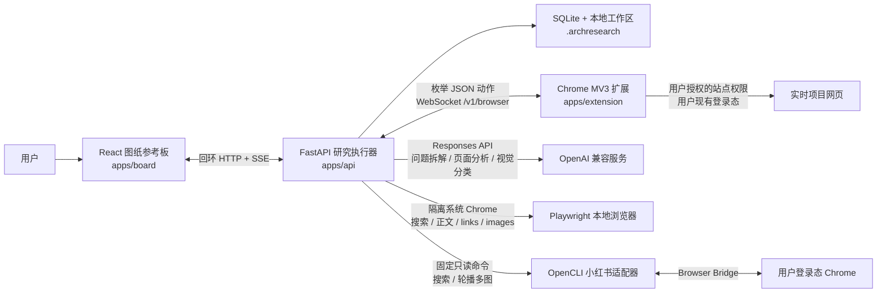
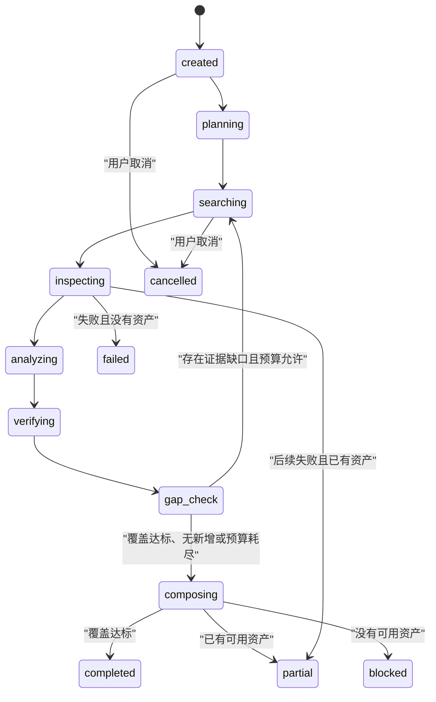
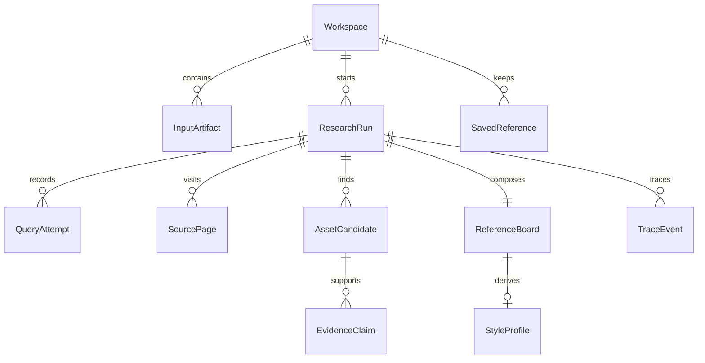

# ArchResearch V2.1 架构

## 产品边界

ArchResearch 是面向单个 Windows/Chrome 用户的本地优先建筑研究工具。它接收具体设计问题和可选的图片、PDF、URL，在限定轮数、查询数、页面数与时间内研究当前网页，识别建筑图纸并把来源证据编排成参考板。

系统不建设平台案例库，不维护跨项目图片索引，不把收藏或拒绝记录变成公共语料，也不引入 PostgreSQL、Redis、S3、Qdrant、Celery、Docker、LangGraph 或多 Agent 运行时。

## 运行组件

| 组件 | 职责 | 不负责 |
|---|---|---|
| 参考板 | 工作区输入、运行状态、筛选、证据详情、收藏/拒绝、2–6 项比较、StyleProfile 与导出 | 自行抓网页、决定来源可信度 |
| 本地 API | 状态机、预算、供应商调用、来源与资产持久化、排序、检查点、版权门禁、TTL 清理 | 使用浏览器 Cookie、运行远程脚本 |
| Chrome 扩展 | 在用户动作授权后打开页面、读取受限语义快照与元数据、枚举媒体、滚动、裁取候选区域 | 读取 Cookie/LocalStorage/密码/私信，发布、点赞、购买或提交普通表单 |
| Playwright 本地浏览器 | 用子问题级查询实时发现公开来源，读取动态渲染后的正文、链接、图片 URL 与图注 | 用户 Chrome 登录态、任意交互、来源/版权升级、批量站点爬取 |
| OpenCLI 小红书适配器 | 使用登录态 Chrome 搜索结构化笔记并下载被选笔记的轮播多图 | 方案事实核验、点赞/收藏/评论/发布、任意 OpenCLI 命令 |
| SQLite/工作区 | 保存业务对象、检查点、临时裁图和导出 | 跨 Workspace 或跨用户召回 |

API 只监听 `127.0.0.1`。扩展首次用一次性配对码连接，随后把轮换后的令牌放在 `chrome.storage.local`；API 落盘保存令牌摘要。

## 研究状态机

每个阶段向 SQLite 提交检查点并写入脱敏 `TraceEvent`。每条 Run 默认设置 14 天保留期，可由用户单独改为永久保留；应用启动时删除到期 Run 及其候选文件、导出文件与关联用户状态，同时清理其他过期临时数据，并恢复未进入终态的运行。`partial`、`blocked`、`cancelled` 和 `failed` 可重试；重试增加 `attempt`，保留已有资产与证据。

默认预算：

| 模式 | 轮次 | 查询 | 页面 | 时间 |
|---|---:|---:|---:|---:|
| Quick | 2 | 4 | 12 | 4 分钟 |
| Balanced | 3 | 8 | 30 | 12 分钟 |
| Deep | 5 | 16 | 60 | 30 分钟 |

当前统一提前停止条件为至少 6 张可用资产、3 个项目且 4 张达到 `verified` 或 `partial`。连续两批无新增资产也会停止并交付已有结果。

## 数据与证据

每张候选图分别记录发布来源等级、项目身份、图片—项目归属、首发来源、权利状态和结果等级。来源可信度与使用权利是两个独立维度。

来源检查采用任务意图优先，而不是固定的 publication tier 排序。`precedent_research` 在同轮不同查询间轮换 ArchDaily、Designboom、Dezeen、Divisare、ArchDaily China，再读取项目官网与可信建筑媒体正文；轮换只扩大候选面，不降低证据准入。事实声明逐条绑定 URL 与逐字引文，项目档案可把同一项目的主文章与一次定向补查所得的最多两个可信文字页合并，项目身份不一致时拒绝合并。`transfer_strategy` 是基于已取证机制的研究转译，模型 relevance 只参与排序。已有引用答案但局部分支仍空缺时终态为 `partial`，不会因未达到全覆盖而整体 `blocked`。图片只是文字覆盖完成后的可选预览与跳转入口，不证明机制；缺图或配图不精准不会阻止案例证据。`visual_reference_search` 先把“我想出一张轴测图，帮我找风格”“效果图怎么出”等宽泛需求规划为互不重复的表达风格方向；用户点名图纸类型时所有方向固定该类型，只有未点名时才选择合适类型。随后检查用户授权的小红书可见页面，逐图提取配色、线型、版式、形体推演和分析图语言。每个方向一次 ranked search，按 rank 最多尝试四篇笔记，累计三篇产生可用资产的帖子后停止；每帖最多四图，整条 Run 共享 48 个逐图检查槽位 / 48 MiB 预览预算。OpenCLI 失败或空结果时只回退 ArchResearch 扩展，两条小红书路径都不可用时诚实终止，绝不把 XHS-only 任务降级成通用网页研究；容量耗尽返回 `visual_budget_exhausted`，真实运行截止时间才使用 `time_budget_exhausted`。小红书资产始终保持 `visual_lead`、未知项目归属与未知权利，并在 Board 中按灵感方向进入独立视觉灵感板，不进入项目档案或项目数量。

正式事实必须绑定 `EvidenceClaim` 的 URL 或 PDF 页码。结果卡把以下内容分开：

- 来源支持的事实；
- 图像中直接可见的观察；
- 设计方法推断；
- 与用户项目不同的条件和适用边界。

模型输出不能自行把项目归属、首发来源或版权提升为已确认状态。分享导出只完整嵌入 `user_owned`、`open_license` 或 `permissioned` 图片；其他图片确定性降级为来源卡、署名和链接。

## 浏览器协议与不可信网页

扩展只接受版本化、字段严格的动作：`open_url`、`wait`、`page_metadata`、`page_snapshot`、`enumerate_media`、`scroll`、`safe_click`、`capture_region`、`type_search_query`、`close_tab`。`page_snapshot` 最多返回 40 个可见标题、正文段落和图注，总计不超过 6000 字符，并沿用敏感页面禁读规则。协议拒绝额外字段、任意选择器、JavaScript、凭据和私网 URL。

网页标题、正文、图注和隐藏文字全部是数据，不能修改工具权限、系统指令、预算或停止条件。API 和扩展都检查导航 URL；API 还解析 DNS，阻止回环、私网、链路本地、保留地址和 IPv4 映射地址。云端模型只接收候选裁图、相邻图注和必要项目文字，不接收完整登录页面。

Chrome 的 `captureVisibleTab` 要求 `activeTab` 或 `<all_urls>`；Agent 的连续页面检查无法让用户逐页触发 `activeTab`。扩展因此只从自身弹窗或侧栏的直接用户手势申请可选 `<all_urls>`，授权会保留到用户主动撤销或卸载扩展。运行完成、取消、失败或断线仍会关闭扩展打开的研究标签页。这个平台权限只负责截图授权：`OpenUrlPayload`、API DNS 检查、扩展最终 URL 复核和脚本注入仍只接受公网 HTTP/HTTPS，`file:`、扩展页、回环、私网、保留地址和 IPv4 映射私网地址均被拒绝。

持续加载页面不再等到第一条研究命令才注入。`open_url` 先创建并在 `chrome.storage.session` 登记一个空白受管 tab，随后为该 tab 安装短生命周期 `tabs.onUpdated` loading 监听，导航到已校验的公共 URL，并用 `injectImmediately` 注入固定的 `assets/content.js`；最新导航的注入成功才返回 tab id。导航代次防止旧文档的迟到结果冒充新文档就绪，生命周期代次会拒绝研究终态后才完成的开页，释放注册时同步取消超时和重试。任何显式私网跳转都会立即失效并关闭该 tab，旧 WebSocket 的迟到命令结果也不能写入新连接。后续命令只发送枚举 DSL，避免重复后加载。该方案刻意不使用 origin 级动态内容脚本，因为 Chrome 动态注册不能按 tab 隔离。显式关闭、五种研究终态、断线、撤权、外部关 tab 与工作线程恢复都会释放监听并清理会话记录；重启恢复在重新配对前先关闭遗留受管 tab。

Chrome broker、终态消息和受管标签在 V2.1 中是单连接资源，因此 API 明确采用全局单活研究租约。新建或重试会同时检查 SQLite 中的活动状态和进程内租约；冲突立即返回 409，不排队也不抢占。崩溃恢复按顺序继续未完成运行，终态通知在工作线程中等待扩展接收完成后才释放租约，避免上一轮终态清理下一轮标签。

## 留存

| 数据 | 默认留存 |
|---|---|
| 未收藏候选图块、临时 DOM | 7 天 |
| 查询、来源元数据、EvidenceClaim、Trace | 30 天 |
| 用户上传、SavedReference、ReferenceBoard、StyleProfile | 用户删除前 |

`InputArtifact` 属于 workspace，不只属于一次 Run。建筑研究没有 PDF 时，Board 继续在开始研究前保存当前场景提交的 URL/文件并直接创建 Run；URL 仅以研究线索字符串进入 planner/query，持久 PDF 最多抽取 2,000 字正文进入同一 research context。有 PDF 时，同一次“开始研究”先把文件、主问题和档位 multipart POST 到非持久化 `/v1/workspaces/{id}/brief-review`：API 在内存中校验大小与 PDF、最多读取 12,000 字，调用同一 typed planning provider 返回 `project_summary`、最多六条 `project_boundaries` 和与档位一致的 `ResearchSubquestion`。该内部请求不写 `InputArtifact`、不占用单活 Run gate，也不产生 ResearchRun；成功后 Board 立即调用现有 input upload 和 Run POST，并把 3/4/6 条 subquestions 放入 `ResearchSpec`。API 校验数量与唯一 id 后写入 `ResearchRun.subquestions`，workflow 的 checkpoint-first planner 直接使用它们而不重新规划。Board 不渲染 review 响应为新的用户界面；失败时保留表单并停止创建 Run，避免静默丢失任务书边界。建筑研究接受可选任务书 PDF 和案例 URL；`visual_reference_search` 不显示这组输入。切换 goal 清空尚未提交的 Board 表单，不删除既有 workspace artifacts。界面不得把 URL 描述为保证优先访问，也不得声称普通建筑研究或图纸灵感会视觉理解用户上传图片；建筑研究不添加 artifact 仍可仅凭问题开始。

`SavedReference` 是用户主动策展的个人收藏，不是记忆层。保存时把研究题目、研究目标和结果摘要写入 snapshot；建筑结果额外写入自包含的 `case_subquestions`，逐项保存子问题题目、项目条件、设计机制、转译步骤、适用边界及与条件/机制 statement 精确匹配的逐字原文，并写入最多三项 typed `case_images`。案例图片只从同一 Run、同一项目且已有 `image_url` 的正式 `AssetCandidate` 中选择：当前收藏资产优先，再优先补足不同资产类型，最后按既有顺序填满并按 URL 去重；它们是项目识别索引，不提升或替代逐题证据。Pydantic `SavedReferenceSnapshot` 是该响应结构的来源，Board TypeScript contract 与之对齐。既有 snapshot 在首次 workspace 收藏读取时，若原 AssetCandidate/Run 尚在，会分别只追加缺失的逐题包和案例图片并持久化兼容升级；没有精确 EvidenceClaim 时保持无原文，而不借用同项目其他分支。受控本地图仍复制到独立 `collections/` 目录，因此普通 Run 的 14 天清理可以删除 checkpoint、候选和导出，同时保留可按收藏 ID 管理的收藏项、逐题研究内容和案例图片索引。一次前端提交完整保存新批次；保存是累加动作，不删除任何既有收藏（含同题旧批），删除只由用户对单项显式执行。Board 仍从同一个 workspace 聚合端点读取完整快照，并在内存中把建筑收藏展平为“原研究题目 + 案例子问题”目录项；选择状态只存在于当前 Board 页面，不写入 URL、数据库或新增 API。目录初始不渲染项目内容；点入后只把所选子问题映射为命名 region，项目保持独立 article，h2–h5 保留语义层级。界面只投影逐题设计机制和去重后的前三条转译步骤，并在其后显示紧凑案例图带。项目条件、完整边界和逐字证据仍在 snapshot 中，不因界面精简而删除。收藏类型切换、离开与重开会清除目录选择。收藏页可原位切换到只消费本地图或 image URL 的图纸视图。图纸灵感高清链接复用同一个安全 collection-content handler，本地副本缺失时才回退 snapshot image URL，原帖来源仍保持独立。该界面精简不新增表、列或 Alembic 迁移。

所有路径都在当前本地工作区内，不建立全局索引。

## 供应商与离线模式

默认 `mock` 模式不需要 Key，也不会调用真实模型或公开网页。真实研究必须由用户主动运行 `scripts/configure-provider.ps1`，在隐藏输入中提供自己的模型 Key；脚本先执行一次小型结构化输出能力探测，成功后才把 Key 存入 Windows 凭据管理器。公开建筑网页由 Direct Playwright 的非持久化隔离上下文搜索和解析；登录态小红书由锁定版本的 OpenCLI Browser Bridge 读取。模型不再承担通用 `web_search`，系统也不依赖按量计费的网页抓取服务。

版本化评测夹具位于：

- `fixtures/queries/research_tasks.jsonl`：30 条人工研究任务，只是数据，不会自行联网；
- `fixtures/evaluation/classification`：108 张 CC0 合成 SVG 和九类标签；
- `fixtures/evaluation/project_brief_cases.json`：用户提供的真实任务书场景摘要、主问题和预期边界/问题术语，用于零成本验证内部任务书整理；
- `scripts/validate-evaluation-fixtures.ps1`：离线检查数量、枚举、文件哈希与确定性重生成。

## 参考实现取舍

架构借鉴成熟开源项目的可迁移模式，但没有直接引入它们的云基础设施或通用画布运行时：

| 项目 | 借鉴 | 明确不引入 |
|---|---|---|
| [Open Deep Research](https://github.com/langchain-ai/open_deep_research)、[GPT Researcher](https://github.com/assafelovic/gpt-researcher)、[STORM](https://github.com/stanford-oval/storm) | 有界研究阶段、覆盖缺口、可评测 Trace | LangGraph、多 Agent 自主循环 |
| [Karakeep](https://github.com/karakeep-app/karakeep)、[Linkwarden](https://github.com/linkwarden/linkwarden) | 混合资产加载、筛选、持久用户状态 | 全局书签库、跨任务语料 |
| [Zotero](https://github.com/zotero/zotero) | 资产、注释与来源定位保持绑定 | 通用文献管理功能 |
| [Excalidraw](https://github.com/excalidraw/excalidraw) | 持久画板状态与临时选择分离 | 无限画布依赖 |
| [Browsertrix Crawler](https://github.com/webrecorder/browsertrix-crawler) | 浏览器任务可恢复、失败显式 | 云端爬虫和批量抓取基础设施 |
| [Playwright](https://github.com/microsoft/playwright-python) | 系统 Chrome、隔离上下文、固定只读 DOM 提取 | 用户配置、任意脚本或第二个 MCP 浏览器服务 |
| [Playwright MCP](https://github.com/microsoft/playwright-mcp) | 有界语义快照、确定性工具 | 宽泛 MCP 工具面 |
| [Stagehand](https://github.com/browserbase/stagehand) | observe-before-act、动作可预览 | 第二套 AI 浏览器与自愈执行器 |
| [Browser Use](https://github.com/browser-use/browser-use) / Browser Harness、[Crawl4AI](https://github.com/unclecode/crawl4ai) | 长连接浏览器、结构化输出、内容过滤与可恢复会话 | 自主 Agent 循环、云端 profile 同步、自动验证码解题和大依赖面；同题实测后由更小的直接 Playwright 取代 |
| [Microsoft Playwright CLI](https://github.com/microsoft/playwright-cli)、[OpenCLI](https://github.com/jackwener/opencli) | 实测后采用 OpenCLI 的小红书结构化搜索、登录态 Chrome Bridge 与整组媒体下载 | Playwright CLI 的通用快照进程开销；OpenCLI 写操作与非小红书命令不进入产品工具面 |
| [BrowserAct](https://github.com/browser-act/browser-act) | 人工接管与失败显式化 | API Key 前置、不可完整审计的编译运行时、Cookie/代理/自动验证码能力 |
| [Steel Browser](https://github.com/steel-dev/steel-browser)、[Lightpanda](https://github.com/lightpanda-io/browser) | 会话隔离、生命周期清理 | Docker/云浏览器、WSL/Linux 浏览器、另一套 CDP 所有权 |
