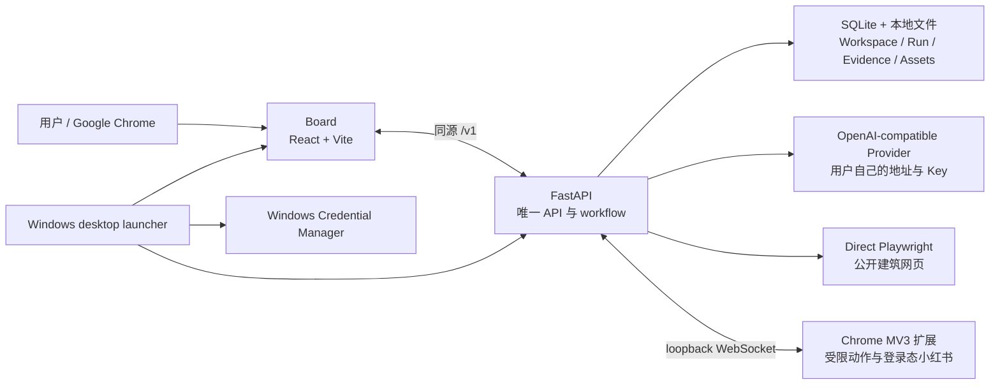
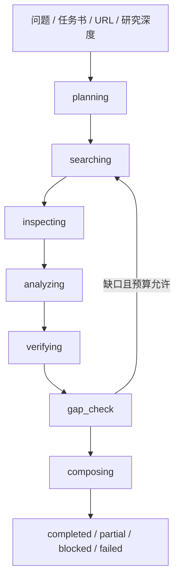

# ArchResearch 本地架构

## 产品边界

ArchResearch 是 Windows/Chrome 本地优先研究工具。FastAPI/Python workflow 是唯一研究执行引擎；Workspace、Run、checkpoint、证据、收藏、输入文件和导出都保存在用户电脑上。系统不建设平台案例库、跨用户历史、全局向量索引、远程数据库或第二套研究引擎。

普通用户通过 Windows 安装器获得自包含运行时，首次配置自己的 OpenAI-compatible API 地址和 Key。Chrome 扩展作为独立组件，只在图纸灵感和可见页面读取时使用。

## 运行组件

| 组件 | 职责 | 不负责 |
| --- | --- | --- |
| `apps/api` | Pydantic schema、FastAPI、七阶段 workflow、Provider、网页读取、SQLite、文件和导出 | 云端多租户、第二套执行引擎 |
| `apps/board` | 本地工作台、历史、结果、收藏、对照、备份与扩展连接 | 长期业务数据的独立浏览器数据库 |
| `apps/extension` | loopback 配对、枚举浏览器动作、受管标签、截图和登录态小红书读取 | 任意脚本、通用表单、社交动作、凭据读取 |
| `desktop.py` | 首次 Provider 配置、动态回环端口、服务启动、健康检查和打开 Chrome | 停止身份不明的端口占用者 |
| `packaging/` | PyInstaller onedir 与 Inno Setup per-user 安装 | 把 Chrome 扩展打进安装器 |

## 桌面启动

1. 启动器读取 `%LOCALAPPDATA%\ArchResearch\data` 中的本地配置和端口状态。
2. 若记录端口的 `/desktop-health` 能证明是 ArchResearch，直接复用已有实例。
3. 否则优先尝试 8000；若被其他程序占用，向操作系统申请空闲回环端口。
4. 同一个端口交给 Uvicorn、生产 Board、`/desktop-health`、`/health`、Chrome URL 和扩展 WebSocket endpoint。
5. 只有严格的 `http://127.0.0.1:<有效端口>/?connect=chrome` 可以由桌面 API 打开。

安装版数据位于安装目录之外，覆盖升级和卸载不会删除用户数据库。源码环境默认使用仓库 `.archresearch`，`scripts/start.ps1` 仍可分别启动 API 8000 与 Vite 5173。

## Provider

首次配置接受带协议和主机的 HTTP(S) 地址，不按供应商或域名白名单限制，也允许用户自己的回环服务。地址不能嵌入用户名或密码。

首次配置明确要求接口地址、模型名称和 API Key；模型名称只从上游列表取得，界面不接受手输模型 ID。配置保存顺序固定：

1. 用户填写接口地址和 Key，调用上游 `/models` 获取候选。
2. 用户从只读列表选择一个模型。
3. 只对选中的模型先探测 Responses，再探测 Chat Completions 结构化输出。
4. 成功后保存地址、模型和协议。
5. Key 只写入 Windows Credential Manager。

任一步失败都不覆盖已有配置或凭据。`gpt-5.6-sol` 只用于读取缺少模型字段的旧配置，不会被新配置隐含选用。默认测试使用确定性 mock，不需要真实 Key。

## Evidence-Grounded Plan-and-Execute

唯一 orchestrator 是 `apps/api/src/archresearch_api/workflow.py`：

- `agent/planning.py` 负责 typed plan、查询预算、可信站点轮换和确定性 fallback。
- `agent/execution.py` 负责取消、checkpoint、恢复去重、页面预算和执行计数。
- `agent/verification.py` 负责逐题 coverage、正文 enrichment 和完成门槛。
- `agent/synthesis.py` 只消费已绑定证据的项目分析，生成综合或诚实 fallback。

建筑先例研究只有 coverage 与 enrichment 同时达标才 `completed`。后续阶段失败会保留已取得的资产、证据和 checkpoint。

## 公开网页与图纸灵感

建筑正文由本地 Direct Playwright 使用系统 Chrome 的隔离上下文读取。请求遵守公网 HTTP(S) 边界，默认拦截图片、媒体和字体以降低流量；页面内容始终视为不可信数据。

图纸灵感只使用小红书：

- 源码环境可先发现 OpenCLI，再回退到已配对扩展。
- Windows 安装版不携带 Node/OpenCLI，直接使用扩展。
- 每方向按 rank 最多检查 4 帖，累计 3 篇 usable；每帖最多 4 图。
- 全任务共享 48 个图像槽位和 48 MiB。
- 所有小红书路径失败时终止，不降级到通用网页图片。

小红书永远是 `aggregator / visual_lead`，不能单独证明项目事实。

## 浏览器协议

本地 Board content script 只在 `127.0.0.1` 或 `localhost` 启动，protocol v1 只接受：

- `status`
- `pair`，其中 endpoint 必须是 loopback `ws:`，token 为有界一次性值

配对后 API 通过 WebSocket 发送固定枚举命令。扩展不接受远程代码、任意 selector、凭据、社交动作或通用表单提交。受管 tab id 只保存在 Chrome session storage，用于 service worker 重启后的清理。

## 数据与证据

主要持久对象：

- `Workspace`
- `ResearchRun` 与七阶段 checkpoint
- `ResearchSubquestion`
- `AssetCandidate`
- `EvidenceClaim`
- `Board`
- `PersonalCollection`
- `TraceEvent`
- 输入文件、预览、导出和备份

正式事实必须绑定自己的 URL 与逐字引文。图片可作为预览和出处入口，但不证明机制。来源 provenance 与 rights status 分开；未知或受限图片在分享导出中降级为来源卡。

新 Run 默认保留 180 天，可逐条永久。`keep_forever` 同时豁免 Run 与其子数据；个人收藏是独立快照，保存只累加，删除只能由用户显式执行。

## 发布与验证

CI 在 `windows-latest` 上执行 fresh setup、Python/TypeScript 完整门禁、packaged Extension E2E、PyInstaller/Inno 构建和真实安装 smoke。发布产物分开：

- `ArchResearch-Windows-x64-Setup-v2.2.8.exe`
- `archresearch-chrome-extension-only-v2.2.8.zip`

安装 smoke 必须覆盖 `--self-test`、`/desktop-health`、`/health`、快捷方式、扩展排除、卸载和用户数据保留。默认门禁不得需要 live Provider Key。
